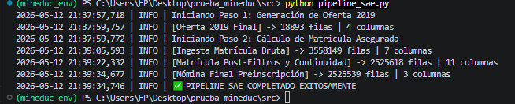
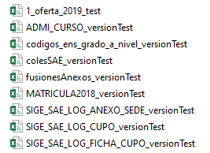

## Sistema de Admisión Escolar (SAE) 2019 - Cálculo de Matrícula Asegurada ##
**Descripción del Proyecto**

Este repositorio contiene la solución técnica para el cálculo de continuidad de estudios y matrícula asegurada del proceso SAE 2019. El proyecto se estructuró en dos fases: un análisis exploratorio para la auditoría y prototipado de los datos, y la construcción de un pipeline de producción automatizado para la generación de los entregables solicitados.

El objetivo central es procesar las bases históricas del Ministerio de Educación, validando la oferta de cursos vigente y determinando los estudiantes que cumplen con los requisitos estructurales e institucionales para mantener su cupo en el establecimiento de origen.


**Arquitectura del proyecto:**

```
analisis_matricula/
├── data/
│   ├── processed/          # Directorio destino para los outputs (CSV resultantes)
│   └── raw/                # Directorio para alojar las bases originales del Ministerio
├── notebooks/
│   └── 01_analisis_matricula_asegurada.ipynb  # Entorno de prototipado, limpieza y EDA
├── src/
│   └── pipeline_sae.py     # Motor principal automatizado
├── .gitignore              
├── README.md               # Documentación
└── requirements.txt        # Dependencias de Python (pandas, matplotlib, etc.)
```
Los archivos CSV originales y procesados son ignorados en el control de versiones por políticas de volumen y privacidad de datos.

**La entrega se compone de los siguientes elementos principales**:

- **analisis_matricula_asegurada.ipynb:** Entorno de prototipado y validación. Documenta el proceso de limpieza, la resolución de inconsistencias estructurales en las bases gubernamentales (como la variación de delimitadores de texto) y la optimización de memoria. Incluye el Análisis Exploratorio de Datos (EDA) que evalúa el impacto sociodemográfico de las reglas de negocio, con foco en la concentración territorial y la distribución por dependencia administrativa.

- **pipeline_sae.py:** Script de producción. Contiene la lógica consolidada en funciones independientes y optimizadas. Integra el manejo de excepciones, un sistema de logging para trazar el volumen de datos en cada etapa y validaciones estrictas de cardinalidad.

- **1_oferta_2019.csv:** Entregable correspondiente a la oferta válida de cursos para continuidad.

- **2_estudiantes_a_preinscribir.csv:** Entregable correspondiente a la nómina de estudiantes con matrícula asegurada.

**Metodología y Decisiones Técnicas**

- **Auditoría de Ingesta:** Se implementó una función de enrutamiento dinámico (cargar_csv_seguro) para resolver la inconsistencia de los separadores (,, ;, |) presentes en los archivos de origen, permitiendo una ingesta automatizada y sin intervención manual.

- **Optimización de Memoria:** Ante el volumen del archivo de matrícula histórica (~400 MB, más de 3.5 millones de registros), el pipeline aplica el parámetro usecols para restringir la carga en RAM estrictamente a las variables de interés antes de aplicar los filtros de estado (modalidad regular, activos, edad normativa).

- **Validación Relacional Estricta:** Se utilizaron uniones (merges) con el parámetro validate="many_to_one" para consolidar identificadores y prevenir la clonación silenciosa de registros durante el cruce de tablas, asegurando la integridad del catálogo SAE.

- **Cálculo Determinista y Resolución de Colisiones:** Implementación de lógica de fechas estricta al 31 de marzo (resistente a años bisiestos) y un sistema de desempate jerárquico para RUNs duplicados, ejecutado estratégicamente después del cruce de oferta para garantizar que ningún alumno pierda su cupo por registros históricos obsoletos.

**Resultados Principales**
La ejecución del modelo sobre los datos históricos arrojó los siguientes hallazgos estructurales:
*   **Volumen de Continuidad:** De un universo inicial superior a los 3.5 millones de registros, el algoritmo validó la continuidad exacta de 2.525.539 estudiantes que cumplen con todos los criterios normativos para asegurar su matrícula en 2019.
*   **Estructura Institucional:** La retención de matrícula mantiene su concentración mayoritaria en el sector Particular Subvencionado y el sector Municipal, respetando la exclusión normativa del sector Particular Pagado en este flujo.
*   **Distribución Territorial:** La Región Metropolitana, Valparaíso y Biobío lideran la concentración de cupos asegurados, reflejando fielmente la distribución demográfica del país.

*(Nota: El desglose analítico y las visualizaciones correspondientes a estos resultados se encuentran detallados en el notebook 01_analisis_matricula_asegurada.ipynb).*

**Captura de comprobación de correcto funcionamiento de pipeline**



---

**Reproducibilidad del Pipeline**

1. Clonación del Repositorio para **evaluadores o analistas con archivos csv originales.** 

**Este repositorio no contiene ningún archivo csv por seguridad de la información, sólo código práctico.**

Para descargar el código a su máquina local, ejecute el siguiente comando en su terminal:

```bash
    git clone https://github.com/CristianRiquelmeF/analisis_matricula.git
    cd analisis_matricula
```

2. Requisitos del Entorno

Se recomienda la ejecución dentro de un entorno virtual de Python (versión 3.8 o superior). Las librerías necesarias son:

- pandas (Procesamiento y manipulación de datos)

- matplotlib y seaborn (Visualización en el entorno de exploración)

Pueden instalarse ejecutando:
```bash
    pip install pandas matplotlib seaborn
```
o también con el método:   
```bash
    pip install -r requirements.txt
```

3. Disposición de los Datos Crudos

Para ejecutar el script, los archivos CSV originales deben estar ubicados en un directorio relativo ../data/raw/ respecto a la ubicación del script, manteniendo los nombres originales proporcionados en el set de datos de prueba. (Por razones de volumen y privacidad, las bases de datos originales no se incluyen en este repositorio).



4. Ejecución

Desde el directorio que contiene el script, ejecute en la terminal:
```bash
    python pipeline_sae.py
```
El pipeline registrará el progreso en consola mediante la librería logging y depositará automáticamente los dos archivos CSV resultantes en el directorio ../data/processed/.
